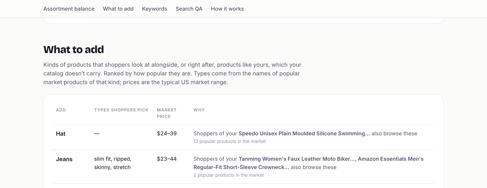

# Catalog X-ray

See what an online store is missing. Paste a store's address, or upload its product export, and get a report on what to add to the range, which keywords each product lacks, and which searches disappoint. Built on [BehaviorGPT](https://github.com/Unbox-AI/behaviorgpt), a model trained on what shoppers actually view, add to cart and buy.

**[Website](https://jenspalmborg.github.io/catalog-xray/) · [Example report](https://jenspalmborg.github.io/catalog-xray/example/)**



> Status: working prototype. Tested on a Shopify fashion store, a beauty store without a product API, and a CSV export.

## What the report tells you

| Section | Question | How |
|---|---|---|
| What to add | Which kinds of products do shoppers of mine want that I don't carry? | Kinds in your departments that appear among your market, or what its shoppers look at next, with nothing of that kind in your catalog. Listed with the styles shoppers pick and a market price range. |
| Keywords to add | Which words would make each product findable? | Words several brands use for similar products, or your own description uses, that don't find the product in your own search. |
| Assortment balance | Where is my range thin or heavy? | Your share of models per product area vs. that area's share of sales in your part of the market. |
| Search QA | Which searches disappoint? | Your product kinds and the top missing keywords, searched in your own catalog. |

Everything is in one HTML page, plus `keywords.csv`, `assortment_gaps.csv` and `search_qa.csv` for merchandisers or re-import.

## Run it

Needs Python 3.11+, [uv](https://github.com/astral-sh/uv) and a BehaviorGPT API key from [unboxai.com/behaviorgpt](https://unboxai.com/behaviorgpt).

```sh
git clone https://github.com/Jenspalmborg/catalog-xray.git
cd catalog-xray
uv sync
cp .env.example .env                               # paste your key as UNBOXAI_API_KEY

uv run xray-web                                    # a page to paste a URL or upload an export
uv run xray https://www.some-store.com             # or the command line
uv run xray --file products.csv --name "My store"  # analyse an export
```

The web app runs on your machine at http://127.0.0.1:8765. Scans run one at a time because your key holds one catalog: each new store replaces the previous upload. Reruns reuse everything already fetched, so iterating takes seconds.

Command-line options: `--max` products to read, `--queries file.txt` to test your own searches, `--fresh` to read the store again, `--delay` seconds between requests, `--no-open`.

## Gentle by design

To avoid loading a store or getting blocked, products are read the lightest way available, falling back only when needed. Every request follows `robots.txt`, identifies itself, and stops at the first refusal.

1. **Upload an export** (Shopify, WooCommerce or any spreadsheet): no requests at all.
2. **The store's product API** (Shopify `products.json`, WooCommerce store API): a few requests, 100–250 products each.
3. **A product feed** (Google Shopping or Facebook catalog): one request.
4. **[Common Crawl](https://commoncrawl.org/)**, the public web archive's copies of the store's pages: no requests to the store.
5. **A sample of product pages**, only if nothing else works: capped at 150 pages, one per second.

## How it works

1. **Read products** ([`scrape.py`](xray/scrape.py), [`importer.py`](xray/importer.py)). Product pages are recognised by their schema.org `Product` data; categories come from the data or the URL path; internal tags (`brand::gender => womens`, ids, price tiers) become plain words.
2. **Upload** ([`catalog.py`](xray/catalog.py)) in BehaviorGPT's catalog format. Colour and size variants are grouped into models.
3. **Describe each product by what it is** ([`nouns.py`](xray/nouns.py)). Brand names mislead search: a shoe called "Pine Runner" finds Christmas trees. So every product gets a generic kind ("women's running shoes") from its name, category, tags and description; a kind the name states wins, and vague ones ("makeup") are refined using the store's own catalog.
4. **Find the market.** BehaviorGPT's search is behavioural: it returns what shoppers engage with, not strict matches. So market neighbours are kept only when they are the same kind, and then used to see what shoppers go on to want.
5. **Stay in your departments.** Shoppers of eyeliner also buy pens; that's real behaviour but not a beauty brand's assortment. Gaps and the balance only count departments (fashion, beauty, home, …) that make up at least 5% of your range.
6. **Analyse and report** ([`analyze.py`](xray/analyze.py), [`report.py`](xray/report.py)).

## Limits

- The market is BehaviorGPT's general US retail catalog: niche, local or non-English stores match it less closely, and prices in "What to add" are US market prices.
- The product vocabulary is English and covers common retail kinds; unusual products fall back to less specific matches.
- Check a store's terms before analysing it, and prefer an export when you have access to one.

The [example report](https://jenspalmborg.github.io/catalog-xray/example/) is a fictional outdoor store made from products in BehaviorGPT's reference catalog ([`examples/example-outdoor-store.csv`](examples/example-outdoor-store.csv)).

## License

MIT
